# Evidence Pack

## Project

**Multi-Cloud VPN Routing Project**

## Business Problem

Many organizations operate across multiple clouds because of acquisitions, cost strategy, compliance requirements, vendor preference, or regional workload placement. The problem is that cloud networks often become isolated from each other. Teams may have AWS workloads, GCP workloads, separate VPCs, separate route tables, and separate security controls, but no clean way to prove that private connectivity works end-to-end.

This project solves that problem by building a Terraform-managed multi-cloud routing environment using AWS networking, GCP networking, VPN tunnels, Cloud Router, BGP route exchange, firewall controls, compute validation, security scanning, and controlled teardown.

## Business Value

This evidence pack proves that the project was:

* Designed with a clear multi-cloud architecture
* Built with Terraform
* Connected through VPN tunnels
* Routed through BGP and cloud route tables
* Secured with firewall and security group controls
* Validated with compute-level testing
* Reviewed through security scanning
* Destroyed cleanly to control cloud cost and reduce drift

## Technical Outcome

```text
Business Need
  ↓
Private AWS ↔ GCP connectivity
  ↓
Terraform-managed infrastructure
  ↓
VPN tunnel creation
  ↓
BGP route exchange
  ↓
Firewall/security validation
  ↓
Compute-level testing
  ↓
Security scan evidence
  ↓
Controlled teardown
```

---

# 1. Architecture Evidence

This project has three architecture views. Use all three because each one proves a different level of the build.

## 1.1 Architecture 1 — Full Multi-Cloud Project

This diagram shows the full project view: AWS VPC, GCP VPC 1, GCP VPC 2, VPN paths, BGP routing, firewall controls, route tables, and validation VMs.

This is the main executive architecture diagram. Use it first in the evidence pack and portfolio README.


**What this diagram proves:**

* AWS and GCP networks were designed as one connected multi-cloud environment.
* AWS-to-GCP connectivity is represented through VPN tunnels and BGP routing.
* GCP-to-GCP connectivity is represented through HA VPN and Cloud Router.
* Firewall rules and security groups are part of the connectivity path.
* Test VMs are included to prove the network was validated with real compute resources.

```text
Users / Internet
  ↓
AWS VPC + GCP VPC 1 + GCP VPC 2
  ↓
VPN gateways + HA VPN gateways
  ↓
Cloud Router + BGP route exchange
  ↓
Firewall/security controls
  ↓
AWS and GCP validation VMs
```

---

## 1.2 Architecture 2 — AWS-to-GCP VPN Routing

This diagram focuses only on the AWS-to-GCP private connectivity path. It should show the AWS VPC, AWS route table, AWS VPN gateway, four AWS Site-to-Site VPN tunnels, GCP Cloud VPN / HA VPN gateway, GCP Cloud Router, and the GCP VPC.

Use this diagram when explaining hybrid or multi-cloud routing between AWS and Google Cloud.


**What this diagram proves:**

* AWS traffic is routed toward GCP CIDRs through the AWS route table.
* The AWS VPN gateway participates in private cloud-to-cloud connectivity.
* Four VPN tunnels provide resilient tunnel paths.
* GCP receives the VPN connection through Cloud VPN / HA VPN.
* Cloud Router handles BGP-based dynamic route exchange on the GCP side.

```text
AWS VPC
  ↓
AWS Route Tables
  ↓
AWS VPN Gateway
  ↓
AWS Site-to-Site VPN tunnels / BGP
  ↓
GCP Cloud VPN / HA VPN Gateway
  ↓
GCP Cloud Router
  ↓
GCP VPC
```

---

## 1.3 Architecture 3 — GCP-to-GCP HA VPN with Cloud Router BGP

This diagram focuses only on the GCP-to-GCP private connectivity path. It should show GCP VPC 1, HA VPN Gateway 1, Cloud Router `vpn-router`, two HA VPN tunnels, Cloud Router `vpn-router-2`, HA VPN Gateway 2, and GCP VPC 2.

Use this diagram when explaining GCP internal cloud networking, dynamic routing, and HA VPN design.


**What this diagram proves:**

* GCP VPC 1 and GCP VPC 2 are connected through HA VPN.
* The encrypted traffic path is carried by the HA VPN gateways and VPN tunnels.
* Cloud Router is used as the BGP control plane, not the packet-forwarding data path.
* `vpn-router` and `vpn-router-2` exchange routes dynamically.
* GCP-to-GCP reachability can be validated between test VMs.

```text
GCP VPC 1
  ↓
HA VPN Gateway 1
  ↓
2 HA VPN tunnels
  ↓
HA VPN Gateway 2
  ↓
GCP VPC 2

Cloud Router vpn-router ASN 65003
  ↔ BGP route exchange ↔
Cloud Router vpn-router-2 ASN 65005
```

---

# 2. AWS Networking

## AWS VPC

This screenshot proves that the AWS network foundation was created. The VPC represents the AWS-side network boundary for routing, VPN connectivity, security groups, and validation workloads.

Business value: this shows the ability to build a controlled AWS network environment that can participate in hybrid or multi-cloud architecture.

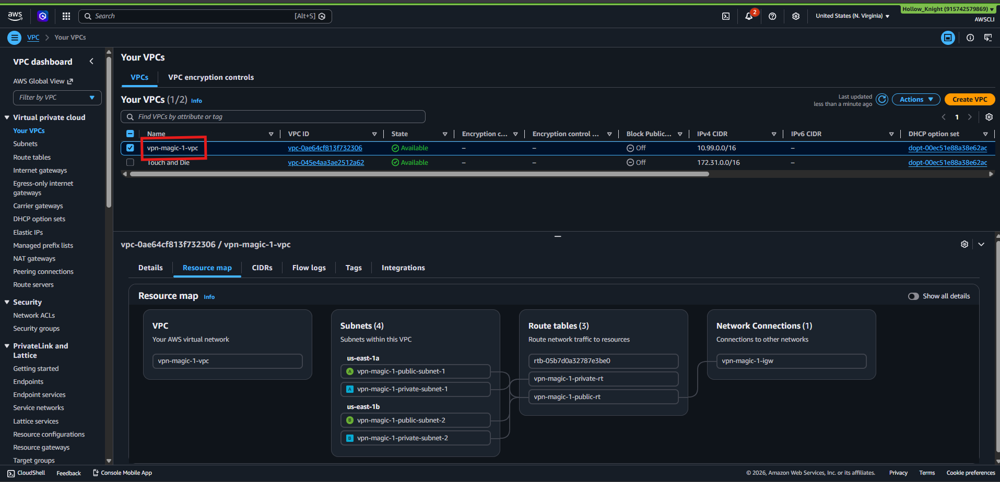

## AWS Route Table

This screenshot proves that AWS routing was configured correctly. Route tables are critical because a VPN tunnel alone does not guarantee connectivity. Traffic must know where to go.

Business value: this proves that the project solves actual routing, not just cloud resource creation.

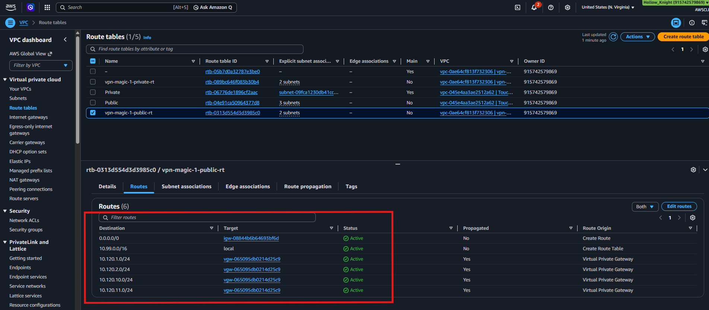

## AWS VPN Status

This screenshot proves the AWS-side VPN tunnel state. It should show whether the tunnels are up, available, or ready to pass traffic.

Business value: this proves AWS can participate in private multi-cloud communication instead of relying only on public internet paths.

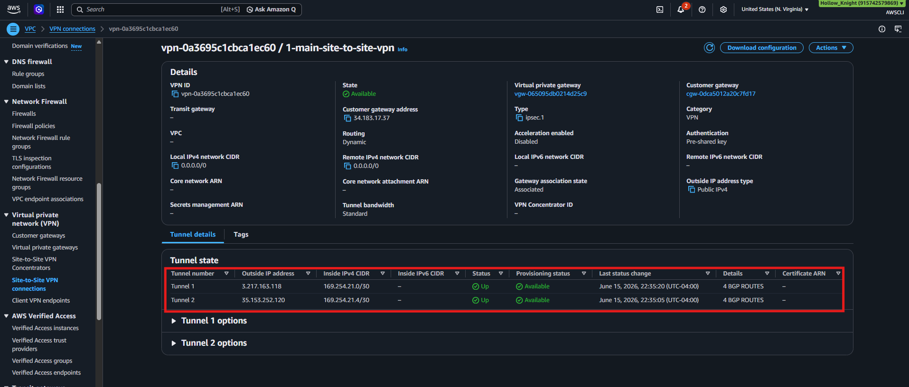

---

# 3. GCP Networking

## GCP VPCs

This screenshot proves that the GCP network environments were created. The GCP VPCs represent the Google Cloud-side network domains used for VPN routing and workload validation.

Business value: this shows the ability to manage multiple cloud network domains and prepare them for secure private connectivity.

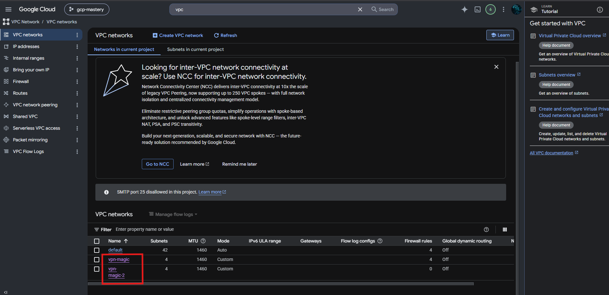

## GCP Subnets

This screenshot proves that the GCP VPCs were divided into usable subnet ranges. Subnets define where workloads can live and how the environment is segmented.

Business value: this shows deliberate network planning instead of default cloud deployment.

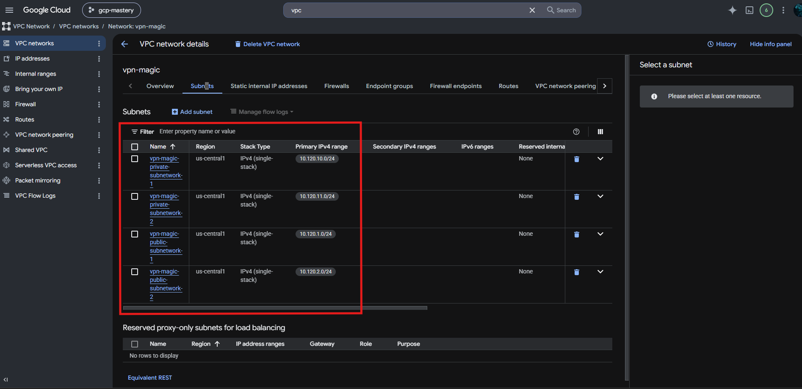

## GCP Routes

This screenshot proves that GCP has route paths for traffic moving between cloud environments. Routes are the operational proof that traffic can leave one network and reach another.

Business value: this shows that the infrastructure can support real cross-cloud workload communication.

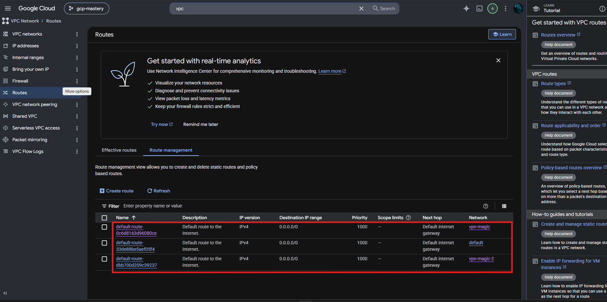

---

# 4. VPN Evidence

## VPN Tunnels

This screenshot proves that VPN tunnel resources were created. VPN tunnels form the private connectivity layer between cloud networks.

Business value: this shows how private cloud-to-cloud communication can be built without exposing internal workloads directly to the public internet.

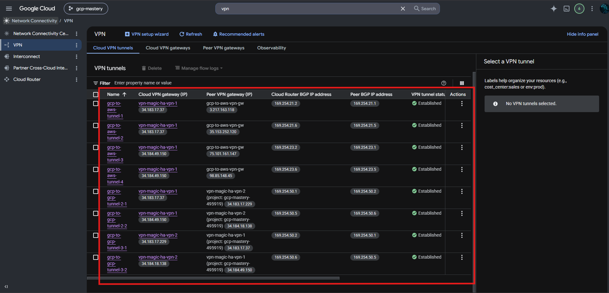

## GCP Tunnel Status

This screenshot proves the GCP-side VPN tunnel state. It should show the tunnel status and confirm that the GCP VPN gateway is participating correctly.

Business value: this gives operational proof that the GCP side of the design is active and reviewable.

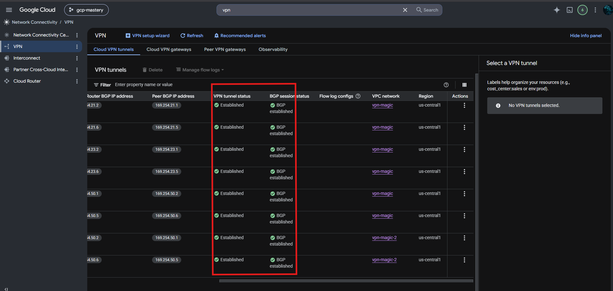

## AWS Tunnel Status

This screenshot proves the AWS-side tunnel state. It should be reviewed with the GCP tunnel status to prove both sides of the connection.

Business value: this shows cross-provider validation instead of trusting only one console view.

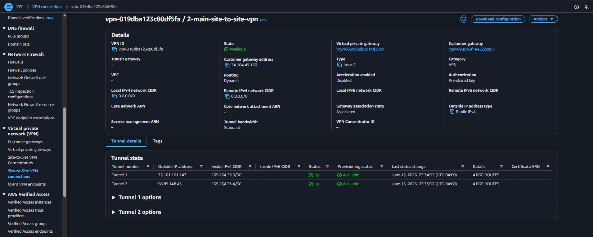

---

# 5. BGP Routing

## Cloud Router

This screenshot proves that GCP Cloud Router was deployed as the dynamic routing control plane. Cloud Router exchanges routes with VPN peers using BGP.

Business value: this shows a more realistic hybrid-cloud design than static-only routing.

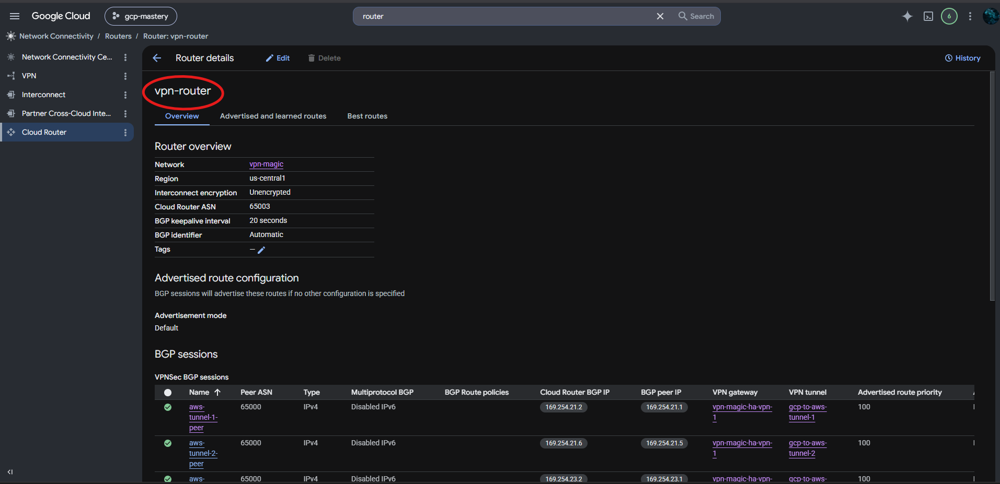

## BGP Sessions

This screenshot proves that BGP sessions were configured and reviewed. BGP controls how networks learn routes from each other.

Business value: this proves routing intelligence, not just tunnel creation.

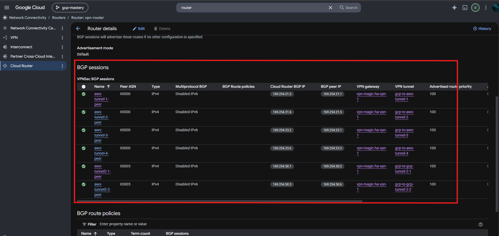

## Advertised and Learned Routes

This screenshot proves which routes are being shared and learned across the VPN path. This is one of the strongest screenshots in the pack because it proves the clouds understand how to reach each other privately.

Business value: this proves the network can support real workload communication across cloud boundaries.

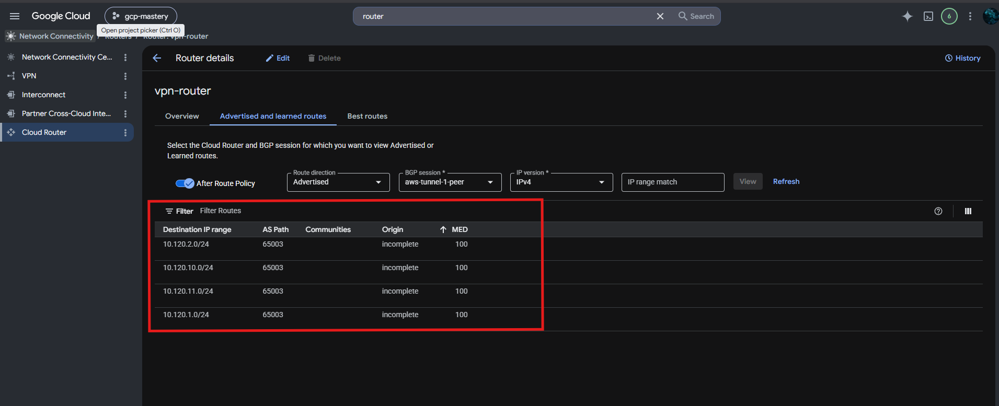

---

# 6. Firewall and Security

## GCP Firewall Rules

This screenshot proves that GCP traffic rules were configured intentionally. Firewall rules define which traffic is allowed into or out of the GCP environment.

Business value: this shows that connectivity was balanced with security controls instead of leaving the environment open.

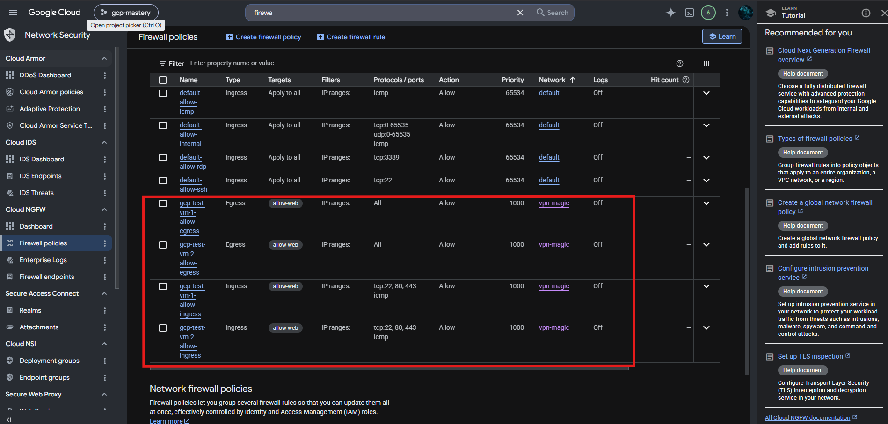

## AWS Security Groups

This screenshot proves that AWS security group rules were configured for the project. Security groups control access to AWS workloads and validation paths.

Business value: this shows access boundary control around cloud workloads.

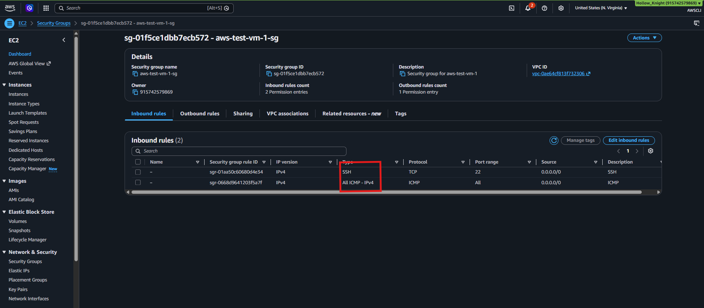

---

# 7. Compute Validation

## VM Private IPs

This screenshot proves the private IP addresses of the validation workloads. These IPs are used to test routing, firewall behavior, and cross-cloud reachability.

Business value: this connects the network design to real compute resources.

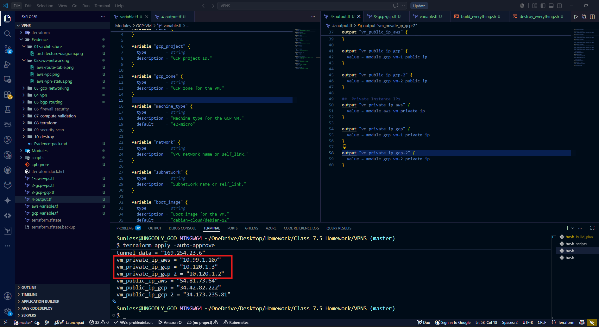

## Cross-Cloud Ping Test

This screenshot proves that traffic can move across the private cloud network path. A ping test is simple, but it proves that VPN, routing, firewall rules, and compute reachability are working together.

Business value: this turns the design from theory into operational proof.

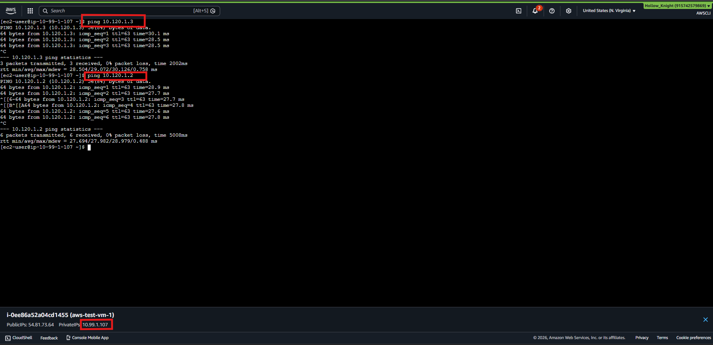

## SSH Test

This screenshot proves controlled administrative access to a validation workload. SSH should be used to prove operability, not broad public exposure.

Business value: this shows the environment can be operated and tested after deployment.

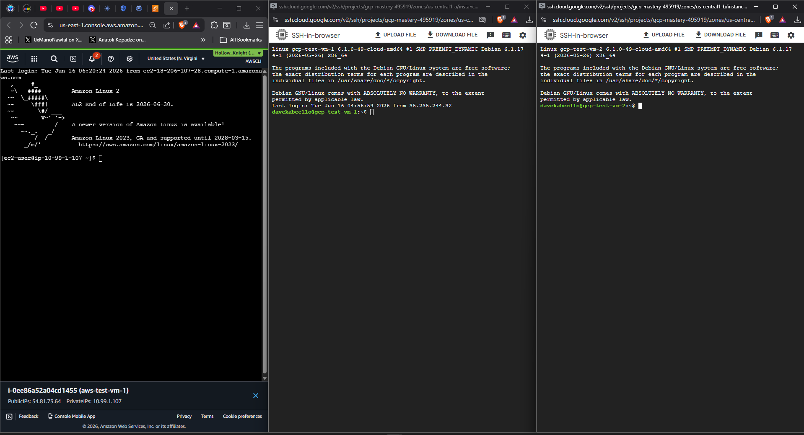

---

# 8. Terraform Evidence

## Terraform Init

This screenshot proves that the Terraform working directory initialized successfully and that providers/modules were prepared.

Business value: this shows the project is reproducible and managed through infrastructure as code.

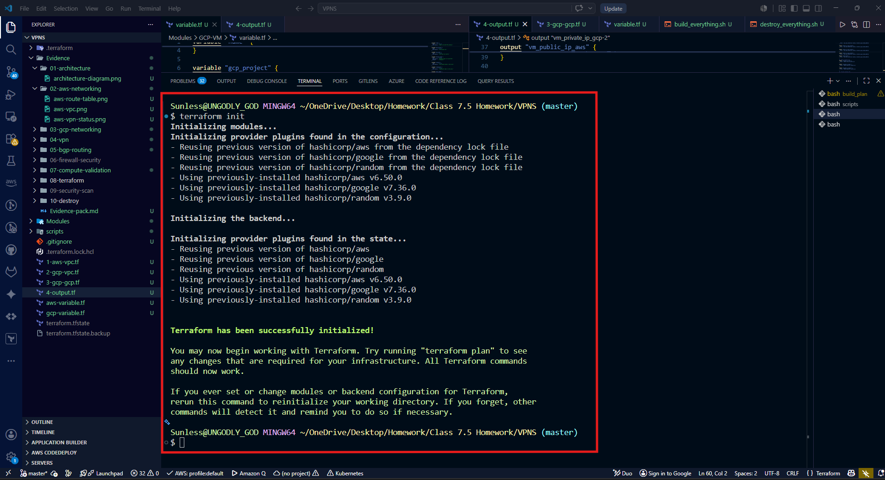

## Terraform Validate

This screenshot proves that Terraform accepted the configuration as valid. This is a quality gate before planning or applying infrastructure.

Business value: this shows disciplined deployment practice instead of manual console-only work.

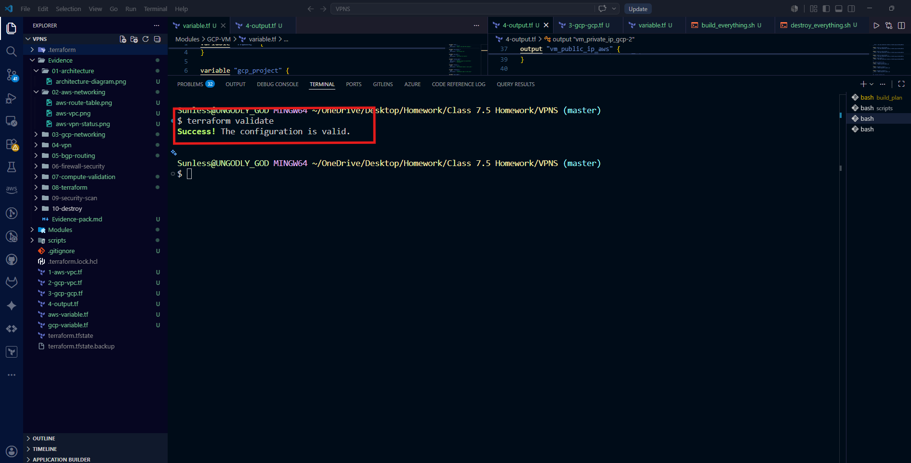

## Terraform Apply

This screenshot proves that Terraform deployed the infrastructure successfully.

Business value: this shows execution capability. The design was not only written; it was built.

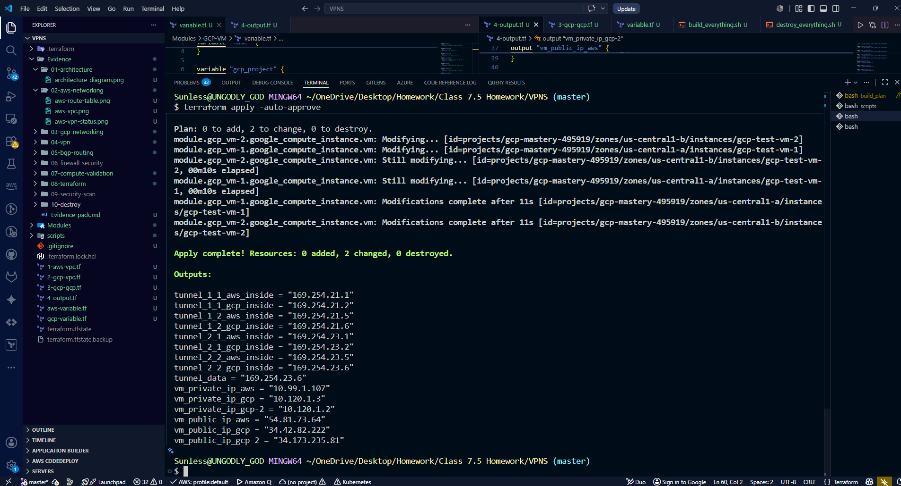

## Terraform Outputs

This screenshot proves the important output values from the deployment, such as VM IPs, VPN-related values, router references, or other operational details.

Business value: outputs make the environment easier to validate, troubleshoot, and hand off.

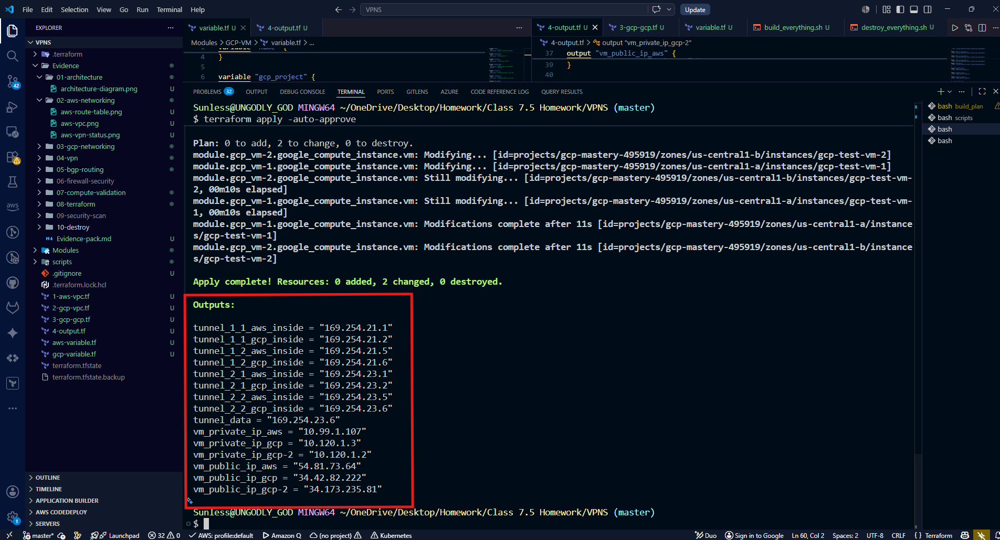

---

# 9. Security Scan

## Local Security Scan

This screenshot proves that the project was reviewed using a local security pipeline. The scan provides evidence that the Terraform was checked before being presented as complete.

Business value: this shows security ownership, not just infrastructure deployment.

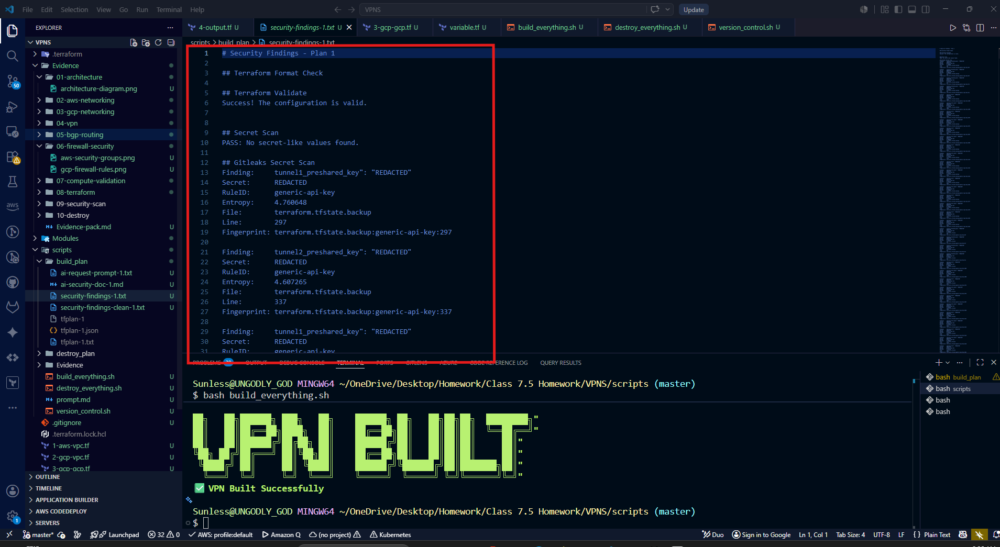

## AI Security Report

This screenshot proves that scanner output was converted into a readable security report. The purpose is to make technical findings understandable for engineers, managers, or reviewers.

Business value: this shows the ability to communicate risk in a business-readable format.

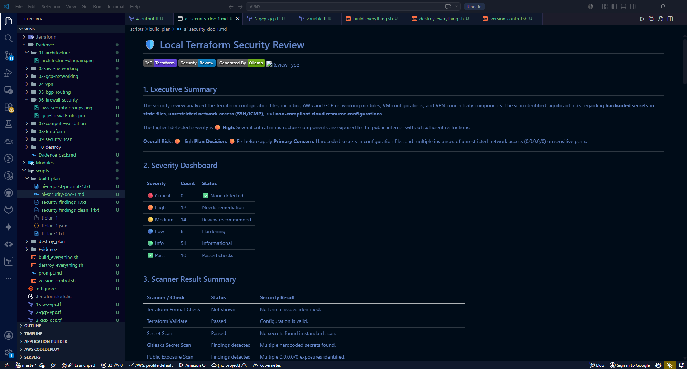

---

# 10. Destroy Evidence

## Destroy Plan

This screenshot proves that teardown was planned before being executed. A destroy plan gives a final review point before removing infrastructure.

Business value: this shows cost control, lifecycle management, and responsible cloud operations.

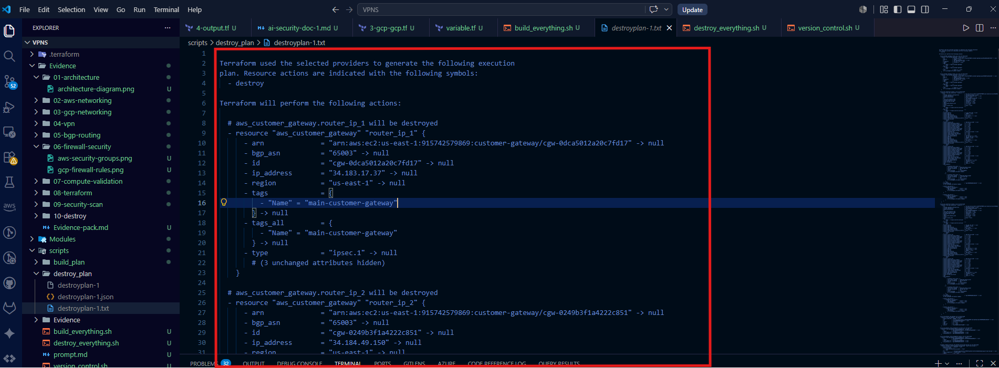

## Destroy Complete

This screenshot proves that the infrastructure was successfully destroyed after validation.

Business value: this shows that the project lifecycle was controlled from build to cleanup.

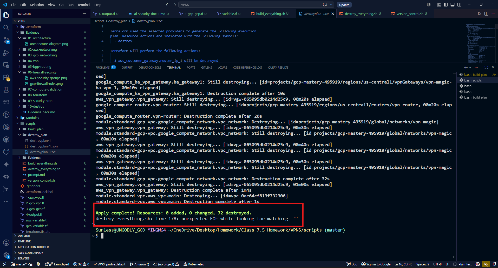

---

# Final Checklist

| Evidence                  | File                                           | Business Meaning                             |
| ------------------------- | ---------------------------------------------- | -------------------------------------------- |
| Architecture              | `01-architecture/architecture-diagram.png`     | Shows the full business and technical design |
| AWS VPC                   | `02-aws-networking/aws-vpc.png`                | Proves AWS network foundation                |
| AWS Route Table           | `02-aws-networking/aws-route-table.png`        | Proves AWS routing path                      |
| AWS VPN Status            | `02-aws-networking/aws-vpn-status.png`         | Proves AWS VPN participation                 |
| GCP VPCs                  | `03-gcp-networking/gcp-vpcs.png`               | Proves GCP network foundation                |
| GCP Subnets               | `03-gcp-networking/gcp-subnets.png`            | Proves subnet planning                       |
| GCP Routes                | `03-gcp-networking/gcp-routes.png`             | Proves GCP routing behavior                  |
| VPN Tunnels               | `04-vpn/vpn-tunnels.png`                       | Proves private connectivity layer            |
| GCP Tunnel Status         | `04-vpn/gcp-tunnel-status.png`                 | Proves GCP-side tunnel validation            |
| AWS Tunnel Status         | `04-vpn/aws-tunnel-status.png`                 | Proves AWS-side tunnel validation            |
| Cloud Router              | `05-bgp-routing/cloud-router.png`              | Proves dynamic routing control plane         |
| BGP Sessions              | `05-bgp-routing/bgp-sessions.png`              | Proves BGP relationship validation           |
| Advertised/Learned Routes | `05-bgp-routing/advertised-learned-routes.png` | Proves route exchange across networks        |
| GCP Firewall Rules        | `06-firewall-security/gcp-firewall-rules.png`  | Proves traffic control in GCP                |
| AWS Security Groups       | `06-firewall-security/aws-security-groups.png` | Proves traffic control in AWS                |
| VM Private IPs            | `07-compute-validation/vm-private-ips.png`     | Proves test targets for validation           |
| Ping Test                 | `07-compute-validation/ping-test.png`          | Proves cross-cloud reachability              |
| SSH Test                  | `07-compute-validation/ssh-test.png`           | Proves controlled administrative access      |
| Terraform Init            | `08-terraform/terraform-init.png`              | Proves IaC initialization                    |
| Terraform Validate        | `08-terraform/terraform-validate.png`          | Proves Terraform quality gate                |
| Terraform Apply           | `08-terraform/terraform-apply.png`             | Proves infrastructure deployment             |
| Terraform Outputs         | `08-terraform/terraform-outputs.png`           | Proves operational deployment values         |
| Security Scan             | `09-security-scan/security-scan.png`           | Proves security review process               |
| AI Security Report        | `09-security-scan/ai-security-report.png`      | Proves business-readable risk communication  |
| Destroy Plan              | `10-destroy/destroy-plan.png`                  | Proves controlled teardown planning          |
| Destroy Complete          | `10-destroy/destroy-complete.png`              | Proves cost-conscious cleanup                |

---

# Final Evidence Summary

This project demonstrates more than cloud resource creation. It shows a complete infrastructure delivery lifecycle.

The business problem was private multi-cloud connectivity. The technical solution was Terraform-managed AWS and GCP networking with VPN tunnels, Cloud Router, BGP route exchange, firewall/security boundaries, validation VMs, security scanning, and teardown controls.

The strongest proof points are:

```text
1. AWS and GCP networks were created.
2. VPN tunnel evidence was captured.
3. BGP routing evidence was captured.
4. Routes were advertised and learned.
5. Firewall and security controls were reviewed.
6. Compute-level connectivity was validated.
7. Terraform was used for repeatable deployment.
8. Security scanning was performed.
9. Infrastructure teardown was planned and completed.
```

This evidence pack presents the work as a business-focused engineering solution: identify the connectivity problem, design the cloud network, build it with Terraform, validate it with screenshots and tests, review it for security, and clean it up responsibly.
