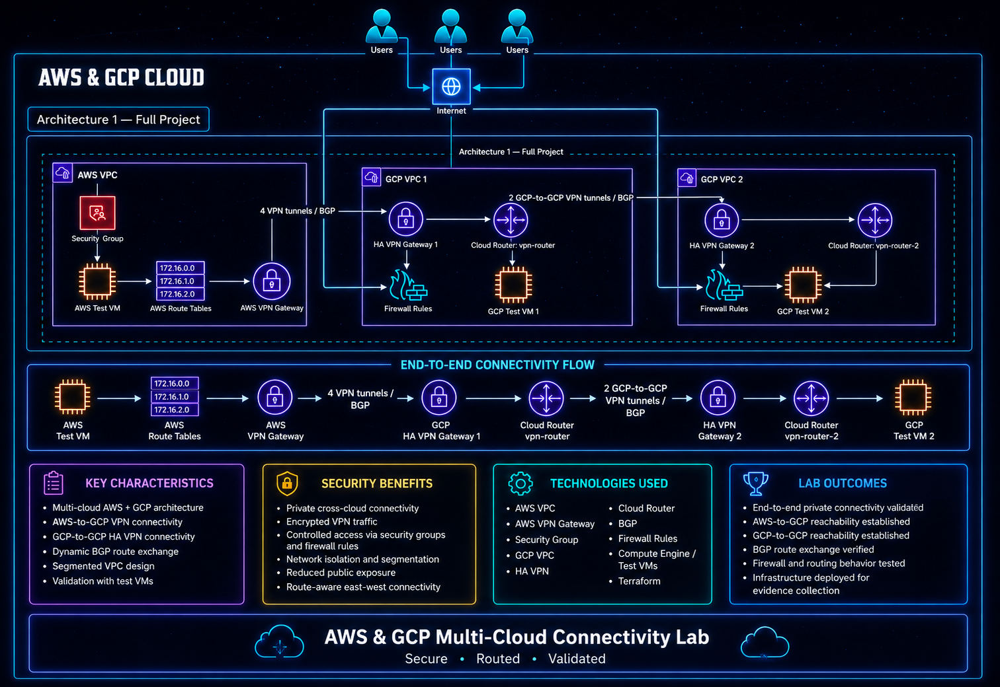
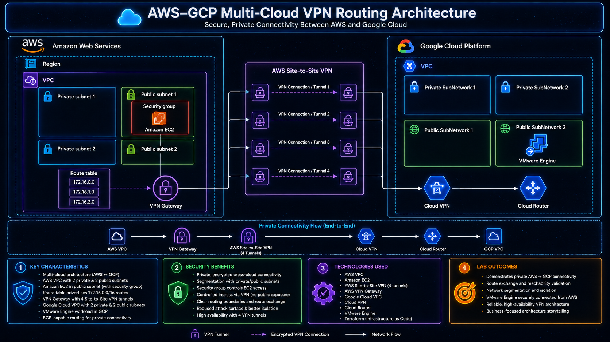
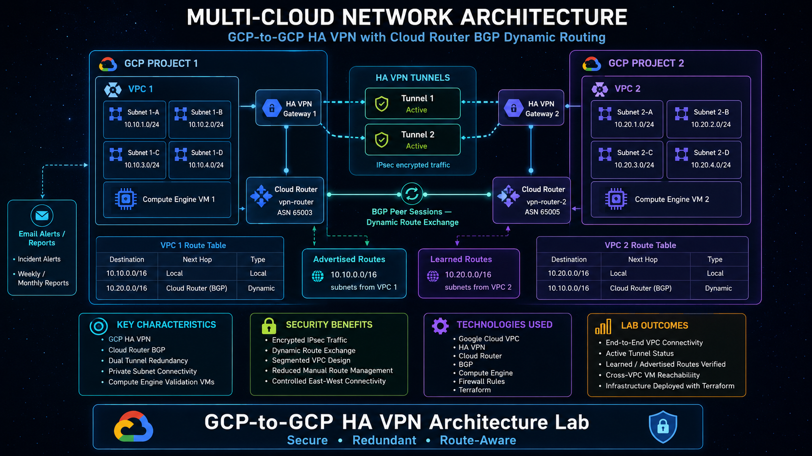

# 🌐 AWS–GCP Multi-Cloud VPN Routing Architecture


A Terraform-managed multi-cloud networking lab that builds private AWS-to-GCP and GCP-to-GCP VPN connectivity using AWS Site-to-Site VPN, Google Cloud HA VPN, Cloud Router, BGP, firewall/security controls, validation VMs, local IaC scanning, AI-assisted security reporting, and controlled teardown automation.

---

## 📋 Table of Contents

- [📌 Lab Objective](#-lab-objective)
- [🧠 Problem Statement](#-problem-statement)
- [🏗️ Architecture](#️-architecture)
- [📊 Architecture Diagrams](#-architecture-diagrams)
- [🖥️ Project Overview](#️-project-overview)
- [🧰 Requirements](#-requirements)
- [☁️ Cloud Services Used](#️-cloud-services-used)
- [📁 Project Structure](#-project-structure)
- [⚙️ Implementation Steps](#️-implementation-steps)
- [🧪 Validation and Testing](#-validation-and-testing)
- [🧰 Automation and Scripts](#-automation-and-scripts)
- [🏢 Enterprise Architecture Mapping](#-enterprise-architecture-mapping)
- [🔐 Security Architecture](#-security-architecture)
- [📊 Observability and Evidence](#-observability-and-evidence)
- [🔁 CI/CD Pipeline Simulation](#-cicd-pipeline-simulation)
- [⚖️ Scaling Considerations](#️-scaling-considerations)
- [🧩 Multi-Service Expansion](#-multi-service-expansion)
- [📸 Evidence Pack Artifacts](#-evidence-pack-artifacts)
- [🧹 Teardown](#-teardown)
- [🧠 Lessons Learned](#-lessons-learned)
- [🧪 Troubleshooting](#-troubleshooting)
- [🚧 Current Limitations](#-current-limitations)
- [🚀 Future Improvements](#-future-improvements)
- [📚 References](#-references)
- [👥 Author](#-author)

---

## 📌 Lab Objective

The objective of this lab is to prove that private multi-cloud routing can be designed, deployed, validated, security-reviewed, and destroyed using repeatable infrastructure automation.

This project demonstrates:

- AWS VPC deployment with public and private subnet segmentation
- Google Cloud VPC deployment with multiple subnet tiers
- AWS-to-GCP VPN connectivity using AWS Site-to-Site VPN and GCP HA VPN
- GCP-to-GCP HA VPN connectivity between two GCP VPCs
- Dynamic BGP route exchange through GCP Cloud Router
- AWS Virtual Private Gateway route propagation
- Test VM deployment for practical reachability validation
- Firewall and security group enforcement
- Terraform plan/apply lifecycle management
- Local Terraform security scanning and AI-generated security documentation
- Controlled destroy workflow for cost and lifecycle management

---

## 🧠 Problem Statement

Organizations often operate across AWS and Google Cloud because of acquisitions, cost strategy, application placement, vendor requirements, or regional workload decisions. The technical challenge is that each cloud network is isolated by default.

Without a controlled private connectivity design, teams may depend on public IP paths, manual routing, inconsistent firewall rules, or undocumented network exceptions. That creates risk, weakens auditability, and makes troubleshooting harder.

This project solves that problem by building a routed multi-cloud lab where AWS and GCP workloads can communicate privately through VPN tunnels and BGP-learned routes.

---

## 🏗️ Architecture

The lab contains three major architecture views:

```text
Architecture 1 — Full Project

Users / Internet
  ↓
AWS VPC
  ├── AWS Test VM
  ├── AWS Route Tables
  ├── AWS Security Group
  └── AWS Virtual Private Gateway
          │
          │ 4 VPN tunnels / BGP
          ▼
GCP VPC 1
  ├── HA VPN Gateway 1
  ├── Cloud Router vpn-router ASN 65003
  ├── GCP Test VM 1
  └── Firewall Rules
          │
          │ 2 GCP-to-GCP HA VPN tunnels / BGP
          ▼
GCP VPC 2
  ├── HA VPN Gateway 2
  ├── Cloud Router vpn-router-2 ASN 65005
  ├── GCP Test VM 2
  └── Firewall Rules
```

```text
Architecture 2 — AWS-to-GCP VPN

AWS VPC
  ↓
AWS Virtual Private Gateway
  ↓
AWS Site-to-Site VPN Connections
  ↓
GCP External VPN Gateway
  ↓
GCP HA VPN Gateway 1
  ↓
Cloud Router vpn-router ASN 65003
  ↓
GCP VPC 1
```

```text
Architecture 3 — GCP-to-GCP HA VPN

GCP VPC 1
  ↓
HA VPN Gateway 1
  ↓
2 HA VPN tunnels
  ↓
HA VPN Gateway 2
  ↓
GCP VPC 2

Cloud Router vpn-router ASN 65003 ↔ BGP ↔ Cloud Router vpn-router-2 ASN 65005
```

Important distinction: HA VPN gateways carry encrypted tunnel traffic. Cloud Router controls dynamic route exchange through BGP.

---

## 📊 Architecture Diagrams

### Full Project Architecture



### AWS-to-GCP VPN Architecture



### GCP-to-GCP HA VPN Architecture



---

## 🖥️ Project Overview

This project deploys a multi-cloud VPN routing environment using Terraform.

The AWS side builds a standard VPC, creates a Virtual Private Gateway, creates customer gateways from the GCP HA VPN interface IPs, provisions two AWS VPN connections, and enables route propagation to public and private route tables.

The GCP side builds one primary GCP VPC and one second GCP VPC. The primary GCP VPC connects to AWS using an HA VPN gateway, an external VPN gateway representation of the AWS VPN endpoints, four GCP VPN tunnels, router interfaces, and BGP peers. The GCP-to-GCP workflow creates a second HA VPN gateway, a second Cloud Router, two HA VPN tunnels, router interfaces, and BGP peers between both GCP networks.

Test VMs are deployed in AWS and GCP so the routing design can be verified from real compute resources instead of only console status pages.

---

## 🧰 Requirements

### Local Tools

| Tool | Purpose |
|---|---|
| Terraform | Infrastructure provisioning |
| AWS CLI | AWS authentication and validation |
| Google Cloud CLI | GCP authentication and validation |
| Bash | Automation script runtime |
| Git | Repository/version workflow |
| Docker | Runs KICS and Terrascan scanners through containers |
| Ollama | Local AI security documentation generation |
| jq | JSON payload creation and response parsing |
| grep / awk / perl | Local scanning and output cleanup |
| Gitleaks | Secret scanning |
| TFLint | Terraform linting |
| Checkov | Terraform IaC policy scanning |
| Trivy | Terraform IaC misconfiguration scanning |

### Cloud Requirements

| Platform | Requirement |
|---|---|
| AWS | Account access with VPC, EC2, VPN, and route-table permissions |
| GCP | Project access with VPC, Compute Engine, HA VPN, Cloud Router, and firewall permissions |
| IAM | Sufficient permissions to create network, compute, VPN, and routing resources |
| Billing | Enabled for AWS and GCP resources used by the lab |

---

## ☁️ Cloud Services Used

| Service | Platform | Purpose |
|---|---|---|
| VPC | AWS | AWS network boundary |
| Subnets | AWS | Public/private workload segmentation |
| EC2 | AWS | Test VM for VPN validation |
| Security Groups | AWS | AWS instance traffic control |
| Virtual Private Gateway | AWS | AWS VPN attachment point |
| Customer Gateway | AWS | Represents GCP VPN gateway public interfaces |
| Site-to-Site VPN | AWS | Encrypted AWS-to-GCP tunnel connectivity |
| Route Tables | AWS | VPN route propagation and forwarding |
| VPC Network | GCP | GCP network boundary |
| Subnets | GCP | GCP workload segmentation |
| Compute Engine | GCP | Test VMs for validation |
| Firewall Rules | GCP | GCP traffic control |
| HA VPN | GCP | GCP VPN gateway for AWS and GCP peer connectivity |
| External VPN Gateway | GCP | Represents AWS VPN public tunnel endpoints |
| Cloud Router | GCP | BGP route exchange control plane |
| Terraform | Local/IaC | Reproducible build and teardown |
| Ollama | Local AI | Converts raw scanner output into security documentation |

---

## 📁 Project Structure

```text
VPNS/
├── README.md
├── 1-aws-vpc.tf
├── 2-gcp-vpc.tf
├── 3-gcp-gcp.tf
├── 4-output.tf
├── aws-variable.tf
├── gcp-variable.tf
├── terraform.tfstate
├── terraform.tfstate.backup
├── Modules/
│   ├── AWS-VM/
│   ├── GCP-VM/
│   ├── Standard-VPC-AWS/
│   └── Standard-VPC-GCP/
├── scripts/
│   ├── build_everything.sh
│   ├── destroy_everything.sh
│   ├── prompt.md
│   ├── version_control.sh
│   ├── build_plan/
│   └── destroy_plan/
└── Evidence/
    ├── Evidence-pack.md
    ├── 01-architecture/
    │   ├── architecture-diagram.png
    │   ├── architecture-diagram-aws-gcp.png
    │   └── architecture-diagram-gcp-gcp.png
    ├── 02-aws-networking/
    ├── 03-gcp-networking/
    ├── 04-vpn/
    ├── 05-bgp-routing/
    ├── 06-firewall-security/
    ├── 07-compute-validation/
    ├── 08-terraform/
    ├── 09-security-scan/
    └── 10-destroy/
```

---

## ⚙️ Implementation Steps

### 1. Configure Variables

Update AWS and GCP variables before deployment:

```hcl
aws_region       = "us-east-1"
gcp_region       = "us-central1"
gcp_project      = "your-gcp-project-id"
project_name     = "vpn-magic"
```

### 2. Initialize Terraform

```bash
terraform init
```

### 3. Validate Terraform

```bash
terraform validate
```

### 4. Review the Plan

```bash
terraform plan
```

### 5. Deploy the Infrastructure

```bash
terraform apply
```

### 6. Run the Full Automation Pipeline

From the `scripts/` directory:

```bash
chmod +x build_everything.sh
./build_everything.sh
```

The script performs initialization, validation, formatting, local security scans, plan generation, apply, and AI-generated security documentation.

---

## 🧪 Validation and Testing

### Terraform Validation

```bash
terraform init
terraform validate
terraform fmt -check -recursive
terraform plan
terraform output
```

### VPN Validation

Validate both cloud console views:

```text
AWS Console → VPC → Site-to-Site VPN Connections
GCP Console → Hybrid Connectivity → VPN
GCP Console → Network Connectivity → Cloud Router
```

Required evidence:

- AWS VPN tunnel status
- GCP VPN tunnel status
- Cloud Router BGP sessions
- advertised routes
- learned routes
- AWS route table propagation
- GCP route visibility

### Compute-Level Validation

Use the Terraform outputs to identify private IPs:

```bash
terraform output vm_private_ip_aws
terraform output vm_private_ip_gcp
terraform output vm_private_ip_gcp-2
```

Then validate reachability from test VMs:

```bash
ping <peer-private-ip>
ssh <user>@<peer-public-ip>
ip route
traceroute <peer-private-ip>
```

Expected result: private cross-cloud reachability works through VPN and routed paths, not through direct public workload exposure.

---

## 🧰 Automation and Scripts

The scripts are a major part of this project. They turn the lab from a manual Terraform deployment into a repeatable engineering workflow with build artifacts, security evidence, AI documentation, and controlled teardown.

### Script Inventory

| Script | Purpose | Output |
|---|---|---|
| `scripts/build_everything.sh` | Full build, scan, plan, apply, and AI documentation workflow | `scripts/build_plan/` artifacts |
| `scripts/destroy_everything.sh` | Destroy-plan generation and infrastructure teardown | `scripts/destroy_plan/` artifacts |
| `scripts/prompt.md` | Strict AI prompt for converting scanner output into a clean security report | `ai-security-doc-N.md` |
| `scripts/version_control.sh` | Early helper script for Terraform/Git prerequisite checks | Terminal validation output |

### `build_everything.sh`

This is the main deployment and evidence-generation script.

It performs:

1. Dependency checks
2. Ollama model validation
3. Docker daemon validation
4. Terraform initialization
5. Terraform validation
6. Terraform formatting
7. Local security scanning
8. Cleaned scanner-output generation
9. Terraform plan creation
10. Human-readable plan export
11. JSON plan export
12. Terraform apply
13. AI-generated security documentation
14. Plan number increment
15. Ollama model shutdown
16. Build summary output

Generated files:

```text
scripts/build_plan/
├── tfplan-N
├── tfplan-N.txt
├── tfplan-N.json
├── security-findings-N.txt
├── security-findings-clean-N.txt
├── ai-request-prompt-N.txt
└── ai-security-doc-N.md
```

Security scanners/checks included:

```text
Terraform Format Check
Terraform Validate
Secret Scan
Gitleaks Secret Scan
Public Exposure Scan
IAM Privilege Scan
TFLint Terraform Lint Scan
Checkov IaC Scan
Trivy IaC Scan
KICS IaC Scan
Terrascan IaC Scan
```

Run it:

```bash
cd scripts
chmod +x build_everything.sh
./build_everything.sh
```

Important behavior:

```text
The current script automatically applies the generated Terraform plan.
Review the script before using it in any shared or production environment.
```

### `prompt.md`

The `prompt.md` file controls the local AI security documentation behavior.

It forces the AI report to:

- use only supplied scanner evidence
- avoid hallucinated findings
- avoid counting skipped tools as vulnerabilities
- deduplicate repeated findings
- separate pass checks from findings
- include architecture only when supported by evidence
- produce an apply/no-apply decision based on the highest detected severity

This is important because it turns raw scanner noise into a reviewable security document.

### `destroy_everything.sh`

This script controls teardown.

It performs:

1. Terraform init
2. Terraform validate
3. Terraform format
4. Destroy-plan creation
5. Human-readable destroy plan export
6. JSON destroy plan export
7. Destroy apply
8. Destroy artifact number increment

Generated files:

```text
scripts/destroy_plan/
├── destroyplan-N
├── destroyplan-N.txt
└── destroyplan-N.json
```

Run it:

```bash
cd scripts
chmod +x destroy_everything.sh
./destroy_everything.sh
```

Important behavior:

```text
The current destroy script automatically applies the destroy plan.
For safer operation, re-enable the manual confirmation block before running this against any environment you care about.
```

### Recommended Script Hardening

For production-style maturity, add:

- manual approval before `terraform apply`
- manual approval before `terraform apply` of destroy plans
- environment selection such as `dev`, `stage`, `prod`
- backend state locking
- artifact checksum generation
- scanner result exit-code policy
- CI/CD integration with plan review gates
- automatic upload of build artifacts to an evidence bucket

---

## 🏢 Enterprise Architecture Mapping

| Enterprise Pattern | How This Project Maps |
|---|---|
| Hybrid connectivity | Simulates secure routing between separate cloud providers |
| Multi-cloud migration | Creates a route-aware bridge between AWS and GCP workloads |
| Network segmentation | Uses VPCs, subnets, route tables, firewalls, and security groups |
| Dynamic routing | Uses Cloud Router and BGP instead of relying only on static routes |
| Infrastructure as Code | Uses Terraform modules and root configuration files |
| Evidence-driven delivery | Stores screenshots, scan results, Terraform plans, and outputs |
| Security review gate | Uses local scanners and AI report generation before final presentation |
| Lifecycle management | Includes controlled teardown and destroy-plan evidence |

---

## 🔐 Security Architecture

### Network Security

- AWS and GCP workloads are separated by cloud provider network boundaries.
- VPN tunnels provide encrypted private connectivity.
- GCP Cloud Router exchanges routes dynamically using BGP.
- AWS route propagation advertises VPN-learned paths into VPC route tables.
- GCP firewall rules control allowed ingress/egress paths.
- AWS security groups control access to AWS validation workloads.

### Access Control

- Test VMs are used for validation and should be treated as temporary lab assets.
- SSH and ICMP rules should be scoped down after validation.
- Public administrative exposure should not be used in a production version.

### Secrets and Tunnel Keys

- VPN pre-shared keys are generated with Terraform `random_password` resources.
- Generated secrets should be protected through Terraform state security.
- Production designs should store sensitive values in a secure secrets backend.

### Infrastructure Security Review

The local security pipeline reviews Terraform using multiple checks:

- secret patterns
- public exposure patterns
- broad IAM patterns
- linting
- IaC policy scanning
- containerized KICS and Terrascan scans
- Trivy high/critical IaC scan
- Checkov Terraform scan

---

## 📊 Observability and Evidence

This lab is evidence-driven. The goal is not only to deploy infrastructure, but to prove the deployment state.

Evidence sources include:

- Terraform plan files
- Terraform JSON plan files
- Terraform outputs
- AWS VPN tunnel status screenshots
- GCP VPN tunnel status screenshots
- GCP Cloud Router BGP screenshots
- learned and advertised route screenshots
- firewall/security screenshots
- compute connectivity screenshots
- local security scan files
- AI-generated security report
- destroy plan and destroy completion evidence

The evidence pack is stored under:

```text
Evidence/Evidence-pack.md
Evidence/01-architecture/
Evidence/02-aws-networking/
Evidence/03-gcp-networking/
Evidence/04-vpn/
Evidence/05-bgp-routing/
Evidence/06-firewall-security/
Evidence/07-compute-validation/
Evidence/08-terraform/
Evidence/09-security-scan/
Evidence/10-destroy/
```

---

## 🔁 CI/CD Pipeline Simulation

This project currently simulates a CI/CD-style infrastructure delivery workflow locally through Bash.

A production CI/CD pipeline could follow this model:

```text
Git Push
  ↓
Terraform fmt check
  ↓
Terraform validate
  ↓
Terraform plan
  ↓
IaC security scans
  ↓
Upload plan and scan artifacts
  ↓
Manual approval gate
  ↓
Terraform apply
  ↓
Post-deploy validation
  ↓
Evidence collection
```

Suggested future CI/CD platforms:

- GitHub Actions
- GitLab CI
- Jenkins
- AWS CodePipeline
- Terraform Cloud

---

## ⚖️ Scaling Considerations

| Area | Current Lab Design | Production Consideration |
|---|---|---|
| VPN tunnels | AWS-to-GCP and GCP-to-GCP lab tunnels | Add HA design review, failover tests, and SLA-aware routing |
| Routing | Cloud Router BGP and AWS VGW route propagation | Consider Transit Gateway, Network Connectivity Center, or hub/spoke routing |
| Firewalling | Basic rules for validation | Replace broad test access with least-privilege CIDR/security-group rules |
| State management | Local Terraform state visible in repo structure | Use remote encrypted backend and state locking |
| Validation | Ping/SSH/manual console proof | Add automated route and reachability tests |
| Security scanning | Local multi-tool scanning | Add CI/CD enforcement and severity-based gates |
| Evidence | Manual screenshots and generated reports | Store immutable evidence artifacts centrally |

---

## 🧩 Multi-Service Expansion

This lab can expand into a stronger enterprise architecture by adding:

- AWS Transit Gateway hub-and-spoke routing
- GCP Network Connectivity Center
- centralized DNS resolution between clouds
- private application workloads behind internal load balancers
- centralized logging and flow logs
- CloudWatch and Cloud Logging dashboards
- SIEM integration
- Cloud NAT / NAT Gateway egress design
- private database connectivity across clouds
- Kubernetes workloads across EKS and GKE
- policy-as-code using OPA, Sentinel, or Checkov gates

---

## 📸 Evidence Pack Artifacts

| Evidence Area | Path |
|---|---|
| Main evidence document | `Evidence/Evidence-pack.md` |
| Full architecture diagram | `Evidence/01-architecture/architecture-diagram.png` |
| AWS-to-GCP architecture diagram | `Evidence/01-architecture/architecture-diagram-aws-gcp.png` |
| GCP-to-GCP architecture diagram | `Evidence/01-architecture/architecture-diagram-gcp-gcp.png` |
| AWS networking screenshots | `Evidence/02-aws-networking/` |
| GCP networking screenshots | `Evidence/03-gcp-networking/` |
| VPN screenshots | `Evidence/04-vpn/` |
| BGP screenshots | `Evidence/05-bgp-routing/` |
| Firewall/security screenshots | `Evidence/06-firewall-security/` |
| Compute validation screenshots | `Evidence/07-compute-validation/` |
| Terraform screenshots | `Evidence/08-terraform/` |
| Security scan screenshots | `Evidence/09-security-scan/` |
| Destroy screenshots | `Evidence/10-destroy/` |

---

## 🧹 Teardown

Manual teardown:

```bash
terraform destroy
```

Scripted teardown:

```bash
cd scripts
chmod +x destroy_everything.sh
./destroy_everything.sh
```

The teardown workflow generates binary, text, and JSON destroy-plan artifacts before destroying the infrastructure.

---

## 🧠 Lessons Learned

- VPN tunnel creation is not the hardest part; correct BGP interface and peer configuration is the harder engineering problem.
- Cloud Router is the routing control plane, not the encrypted data path.
- HA VPN gateways move encrypted traffic; BGP sessions exchange route knowledge.
- Terraform outputs are critical for validating tunnel inside addresses and VM IPs.
- Evidence packs make infrastructure work easier to explain to recruiters, engineers, and interviewers.
- Local security automation improves the credibility of the project because it proves review discipline.
- Destroy evidence is part of professional cloud engineering because cost control and cleanup matter.

---

## 🧪 Troubleshooting

| Issue | Likely Cause | Fix |
|---|---|---|
| BGP peer fails to establish | Wrong inside tunnel IP or peer IP | Verify `/30` CIDRs and host IP assignments |
| GCP router interface error | Interface IP does not match VPN tunnel/BGP peer expectation | Use correct `169.254.x.x/30` interface range |
| AWS VPN tunnel down | PSK mismatch, peer IP mismatch, or tunnel pairing issue | Compare AWS tunnel details with GCP tunnel configuration |
| Ping fails but tunnel is up | Missing route or firewall rule | Check AWS route propagation, GCP routes, SGs, and firewall rules |
| SSH fails | Security group/firewall source range issue | Verify TCP/22 ingress and source CIDRs |
| Terraform dependency issue | Cross-cloud resource references not available yet | Add explicit dependencies or split workflow phases |
| Scanner output is noisy | ANSI/control characters in tool output | Use the script’s cleanup function and clean output file |
| Ollama report is empty | Model missing, API not running, or jq/curl issue | Confirm `ollama list`, model name, and local API availability |
| Docker scanners fail | Docker Desktop/daemon not running | Start Docker before running KICS/Terrascan sections |

---

## 🚧 Current Limitations

This is a lab project, not a production-ready enterprise network.

Known limitations:

- SSH source ranges may be broad for testing and should be restricted for production.
- Terraform state must be protected because VPN pre-shared keys are generated and stored in state.
- The build script automatically applies the Terraform plan.
- The destroy script automatically applies the destroy plan.
- The design does not yet include centralized DNS, flow logs, SIEM integration, or automated reachability tests.
- There is no remote backend/state-locking configuration shown in this README.
- Evidence capture is screenshot-driven rather than fully automated.

---

## 🚀 Future Improvements

- Add remote encrypted Terraform backend with locking
- Add GitHub Actions or GitLab CI pipeline
- Add manual approval gates before apply/destroy
- Add automated ping/route validation scripts
- Add VPC Flow Logs and Cloud Logging evidence
- Add CloudWatch and GCP monitoring dashboards
- Add DNS resolution between AWS and GCP
- Add AWS Transit Gateway or GCP Network Connectivity Center
- Add SIEM integration for VPN, firewall, and route-change events
- Add policy-as-code gates for public exposure, IAM, and secrets
- Add production-grade least-privilege firewall and security group rules

---

## 📚 References

- AWS Site-to-Site VPN documentation
- AWS Virtual Private Gateway documentation
- AWS Customer Gateway documentation
- AWS VPC route table documentation
- Google Cloud HA VPN documentation
- Google Cloud Cloud Router documentation
- Google Cloud BGP session documentation
- Terraform AWS Provider documentation
- Terraform Google Provider documentation
- Checkov documentation
- Trivy documentation
- TFLint documentation
- Gitleaks documentation
- KICS documentation
- Terrascan documentation
- Ollama documentation

---

## 👥 Author

**Gavin Fogwe**  
Cloud Security / Cloud Infrastructure Engineer  
GitHub: `7twoduo`

---

## Final Summary

This project demonstrates a complete multi-cloud infrastructure delivery lifecycle:

```text
Design
  ↓
Terraform Build
  ↓
AWS-to-GCP VPN
  ↓
GCP-to-GCP HA VPN
  ↓
BGP Route Exchange
  ↓
Firewall and Security Validation
  ↓
Compute Reachability Testing
  ↓
Local Security Scanning
  ↓
AI Security Documentation
  ↓
Evidence Pack
  ↓
Controlled Teardown
```

The strongest engineering value is not just that resources were deployed. The value is that the project shows routing, validation, security review, evidence generation, and cleanup as one connected workflow.
